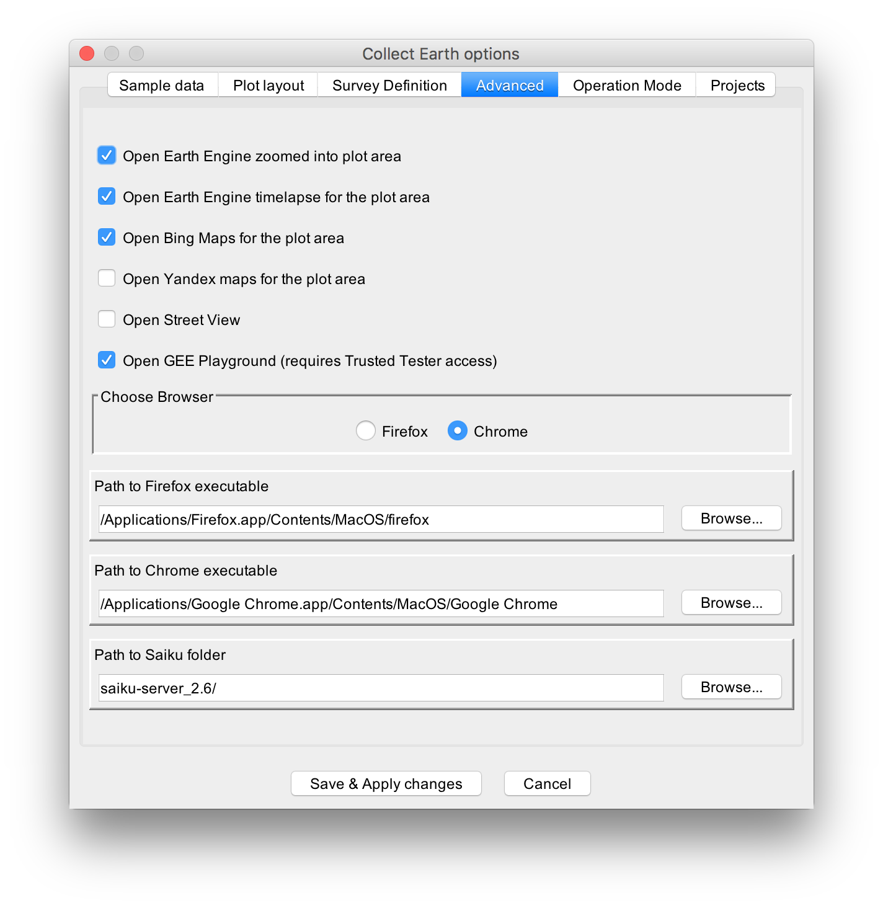

---
authors:
- admin
categories:
- Drawing Board
- Research
- Resources
date: "2017-08-29T21:00:00Z"
draft: true
featured: false
image:
  caption: "The suite of Open Foris software tools for environmental monitoring."
  focal_point: ""
  placement: ""
  preview_only: true
lastmod: "2017-08-29T21:00:00Z"
projects:
- 04_myanmar-tier2
subtitle:
summary:
tags:
- Big Data
- cloud computing
- FOSS
- Google Earth Engine
- Open Foris
- software
title: 'Learning Open Foris tools (Part 1).'
---
Here's another suite of software tools that land change scientists and geospatial analysts should have in their toolbox: [Open Foris](http://www.openforis.org/home.html).

Open Foris is a set of free and open-source software tools designed to facilitate flexible and efficient data collection, analysis, and reporting for environmental monitoring such as forest inventories, climate change reporting, socio-economic surveys, biodiversity assessments, land use/cover change assessments, among others [1]. This initiative, resulting from the collaborative efforts of numerous public and private institutions, is hosted by the Food and Agriculture Organisation of the United Nations.

At the moment, I am specifically interested in learning [Collect Earth](http://www.openforis.org/tools/collect-earth.html), one of the Open Foris tools that enables data collection through the [Google Earth](https://www.google.com/earth/) interface, to streamline my image classification and analysis workflow in [Google Earth Engine](http://www.openforis.org/tools/collect-earth.html). Used in conjunction with [Collect](http://www.openforis.org/tools/collect.html), another tool for designing survey forms and managing survey data, bespoke data entry forms can be setup and streamlined with a user-friendly interface, say, for land use/cover change assessments. (Note that there are a few other tools included in the Open Foris suite such as [Collect Mobile](http://www.openforis.org/tools/collect-mobile.html), [Calc](http://www.openforis.org/tools/calc.html), and [Geospatial Toolkit](http://www.openforis.org/tools/geospatial-toolkit.html), which I have not yet explored but could still be useful and relevant in support of my research in the near future.)

In a nutshell, Collect Earth essentially facilitates the interpretation of high and medium spatial resolution imagery available in Google Earth, Bing Maps, and Google Earth Engine. It simplifies the data entry process in land use/cover change assessments (e.g., identifying regions of interest for classification and analysis), synchronises the view of each sampling point across all three platforms to streamline the process of reviewing satellite imagery, and seamlessly integrates this database of sampling points with Google Earth Engine for wall-to-wall image classification.

For this post, I will just share a few notes regarding the installation and setup of the Collect Earth system for Mac OSX. Basically I just followed the [installation tutorial](http://www.openforis.org/tools/collect-earth/tutorials/installation.html) from the Collect Earth website. After installing Collect Earth and Google Earth Pro, I launched Collect Earth and went ahead with the setup, which involved indicating the operator name and tinkering with settings such as language and browser preferences.



Collect Earth allows the user to modify optional settings, particularly found in the `Tools > Properties > Advanced` tab such as selecting a preferred browser (i.e., Firefox, Chrome). For my system, I opted to check the boxes to open Chrome browser windows with Google Earth Engine Playground as well as its timelapse and zoom into the plot area. I also opted to open Bing Maps. In a Mac OSX system, the paths to the Firefox and Chrome executables can be specified as follows:
```bash
/Applications/Firefox.app/Contents/MacOS/firefox
```
```bash
/Applications/Google Chrome.app/Contents/MacOS/Google Chrome
```
(I did not tinker with the settings related to the survey data, particularly under the Sample Data, Plot Layout, Survey Definition tabs as I figured it will go together with using the Collect tool.) Once my settings were defined, I took Collect Earth for a spin to check whether the synchronised interfaces worked by using one of the project examples from their website.

However, after loading one of the project files and clicking at one of the plot areas, I observed that the HTML survey form designed for the project had popped out, but the synchronised browser interfaces failed to launch. After consulting the [support community](http://www.openforis.org/support) and the log file (`Help > Open Application Log File`), I learned that Collect Earth was unable to launch the Chrome/Firefox browsers despite having specified the correct pathnames to the browser applications.

To rectify this, I had to open the `earth.properties` file found in `/Library/Application Support/CollectEarth` under my user account (or just go to `Tools > Open Data Folder`). I figured out that the pathnames to the browser applications in the file were incorrect despite having correctly entered them in the Collect Earth Options dialog box (perhaps it is a bug in the software). And so, I edited the `earth.properties` file directly by replacing the following path lines:
```bash
firefox_exe_path=/Applications/Firefox.app/Contents/MacOS/firefox
chrome_exe_path=/Applications/Google Chrome.app/Contents/MacOS/Google Chrome
```
After a bit of troubleshooting and rectifying the erroneous path entries, I gave it another try until the synchronised interfaces finally worked. The following screenshots show the different synchronised browser interfaces that I selected.


The next post will be about designing bespoke survey forms for Collect Earth using the Collect tool. Watch this space.

**References:**

[1] Bey, A., Sánchez-Paus Díaz, A., Maniatis, D., Marchi, G., Mollicone, D., Ricci, S., et al. (2016) Collect Earth: land use and land cover assessment through augmented visual interpretation. *Remote Sensing*, **8**, 807. [[DOI](https://dx.doi.org/10.3390/rs8100807)].

