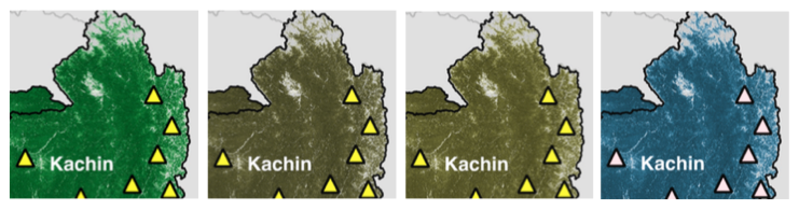

---
authors:
- admin
categories:
- Drawing Board
date: "2017-09-16T20:51:00Z"
draft: false
featured: false
image:
  caption: ""
  focal_point: ""
  placement: ""
  preview_only: false
lastmod: "2017-09-16T20:51:00Z"
projects: []
subtitle:
summary:
tags:
- cartography
- color vision
- data visualisation
- map design
- software
title: 'Designing maps for the color vision impaired.'
---

Cartography involves the drawing of maps, which in fact is both a science and an art. I've come to learn in the course of my years of study and professional experience that mapmaking is not as easy as it seems. Maps tell a story. And for maps to effectively tell that story, the mapmaker should think not only about the main subject of the map, but should also give due consideration to the various map elements such as their position and balance across the map, as well as the accuracy of the measurements, and the styling of these elements which involve, for example, the choice of colors, line weights, among other considerations.

To be honest, although I've been making maps for my entire professional career, I have never considered color vision impairment in the design of maps, at least those that I have made myself. (For instance, the green and red color scheme that I consistently use to depict forest loss and forest gain would be the same shade of gray for a person with color vision impairment.) I have always kept in mind the psychology of colors in maps to help get the message across to the users of these maps, thereby allowing them to better understand the story that the map intends to tell. But unfortunately, I have not put myself in the shoes of a person with color blindness and have given enough thought on how they would perceive and understand those maps. At least not yet.

The opportunity to rectify this finally came in the process of finalising a map figure for the final proof of our recently accepted paper for publication. A colleague of mine, G, suggested that we consider designing the color scheme of the figure to be more friendly for color blind people. It was a brilliant suggestion. I had not thought of it at first (yet again) and I welcomed it because it gave me the chance to learn and design maps for both people with normal vision and color vision impairments.

To implement this, luckily an app called [Color Oracle](http://colororacle.org/) existed, which is a free color blindness simulator that can be used across computer platforms. It shows what people with common color vision impairments would see in real time, thus allowing a person to select appropriate colors in designing the color scheme of a material, website, or publication. Color Oracle basically applies a color filter over the full screen of your computer regardless of the software in use.

For example, the screenshots of the same portion of the map figure below was the result of the Color Oracle app showing me what a person with normal vision would see and what a color vision impaired person would see. Through these color filters, I then selected colors that would ensure the images can be read by people with normal vision and color blindness. It adds another layer of consideration in designing maps, even making it more challenging, but this ensures that the map can be read by and be accessible to the widest possible audience.

*Screenshots of the same portion of a map figure showing the colors that people with normal color vision would see (leftmost image) and the colors that people with color vision impairments would see, particularly those with deuteranopia (2nd from left), protanopia (3rd from left), and tritanopia (rightmost image).*

For additional reading, visit the [Color Oracle](http://colororacle.org/) website and read the papers by Jenny & Kelso (2007a, 2007b) to learn more about the design of information graphics and maps that are accessible for color-impaired readers.

**References:**

Jenny, B., Kelso, N. V. (2007a). Designing maps for the color-vision impaired. *Bulletin of the Society of Cartographers* SoC, **41**, 9-12. [[PDF](http://colororacle.org/resources/2007_JennyKelso_DesigningMapsForTheColourVisionImpaired.pdf)]

Jenny, B., Kelso, N. V. (2007b). Color design for the color vision impaired. *Cartographic Perspectives*, **58**, 61-67. [[PDF](http://colororacle.org/resources/2007_JennyKelso_ColorDesign_lores.pdf)]