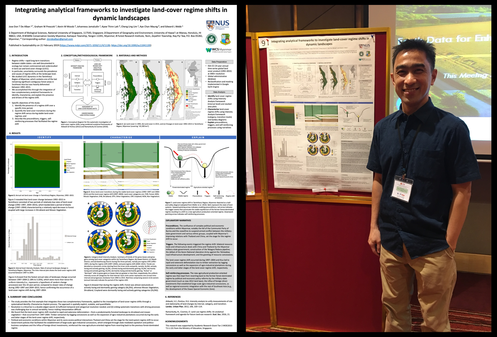
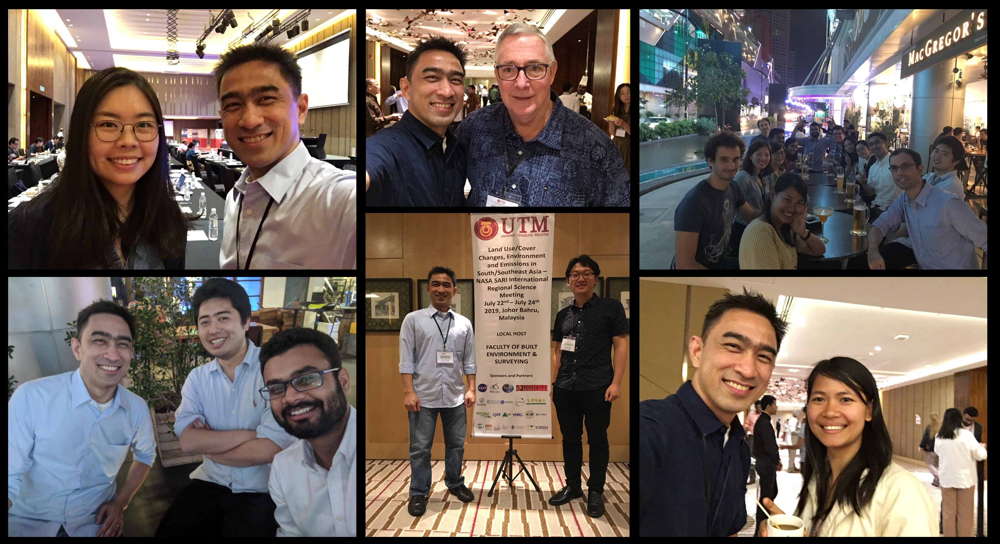

---
authors:
- admin
categories:
- Events
date: "2019-07-25T22:12:00Z"
draft: false
featured: false
image:
  caption: ""
  focal_point: ""
  placement: ""
  preview_only: false
lastmod: "2019-07-25T22:12:00Z"
projects: []
subtitle:
summary:
tags:
- LUCC
- NASA
- scicomm
- science meeting
title: 'Some impressions during the NASA SARI LCLUC science meeting.'
---

I had the opportunity to present a poster at the [international science meeting](http://lcluc.umd.edu/meetings/sari-searrin-meeting-and-training-malaysia-2019) of the land cover / land use change (LCLUC) programme of NASA's South/Southeast Asia Regional Initiative, held in Johor Bahru, Malaysia from 22nd to 24th of July 2019. My poster presentation was about our study on investigating land-cover regime shifts by integrating complementary analytical frameworks in the Tanintharyi Region, southern Myanmar, which was published earlier this year in a special issue of Sustainability journal ([full paper here](https://www.mdpi.com/2071-1050/11/4/1139/htm)). I have not done a poster presentation in a very long while---my last one was back in 2004, if my memory serves me right---and so this time around it was an immensely gratifying experience, particularly seeing how other scientists were genuinely interested in what we found, how they thought of using the approaches and results of our study to build on their own work, as well as providing constructive feedback. Actually, I even won, to my utmost surprise, the 3rd best poster award out of about 50 posters presented during the meeting!

I am starting to think I prefer doing poster presentations now better than oral presentations simply because the posters get to stay on display for the duration of the meeting and the people who engage and interact with you during poster sessions, in my opinion, are those who are really interested in your work or have the same research interests as you. In oral presentations, of which I've done much more frequently in the past, you would usually only have a short amount of time to present your study, and more often than not, hardly enough time is available at the end of your talk for questions or meaningful discussions with the audience. During the meeting's plenary discussion, one of the main suggestions for future meetings was to have more poster presentations and less oral presentations, of which I am delighted about and of which I think should be the better way moving forward.

There were also some insightful and interesting talks during the oral keynote presentation sessions. Of note were talks by:

- Thuy Le Toan (CESBIO, France) who presented about the BIOMASS Mission, the first ever P-band SAR sensor planned to be launched in space by 2022 to observe tropical forests. The BIOMASS mission is a truly exciting project because it will allow scientists to answer what the role of forests are in the global carbon cycle, and this time with less uncertainty in measurements by utilising SAR tomography; and

- Jeffrey Fox (East-West Center, USA) who talked about his long-term research on the expansion of rubber (Hevea brasiliensis) and its implications for water, carbon, and livelihoods across montane mainland Southeast Asia. After his talk, it got me into thinking: with rubber prices currently really low, what would happen to existing rubber plantations? Would these rubber plantations be converted into other plantations with more lucrative agricultural commodities (like oil palm) so that the plantation owners/farmers can profit from their investments? If not, would it potentially open new frontier areas of deforestation to make way for other lucrative plantations that would then serve as an alternative source of income while at the same time keeping their rubber plantations (in wait until prices become more profitable again)?

Finally, it was a pleasure meeting other remote sensing and land change scientists and learning about their research work in the region and elsewhere. Some of them I've met for the first time (like Xiaobo, Haemi, Prakhar, Garrett), and some who I met in the last science meeting (like Hoa, Arai, Sumalika), and then Thuy whom I've known before during the ALOS K&C science meetings in Japan as well as Jeff who came to visit our lab in Singapore.

