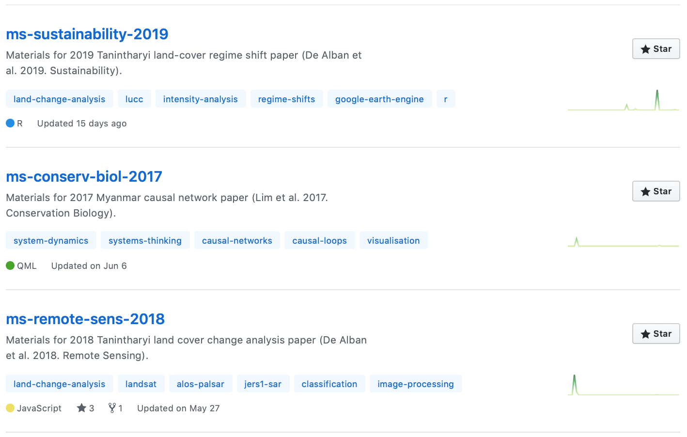
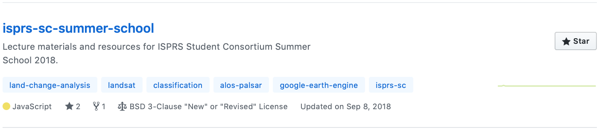
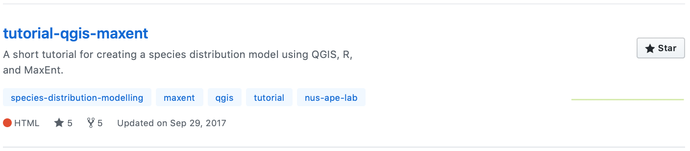
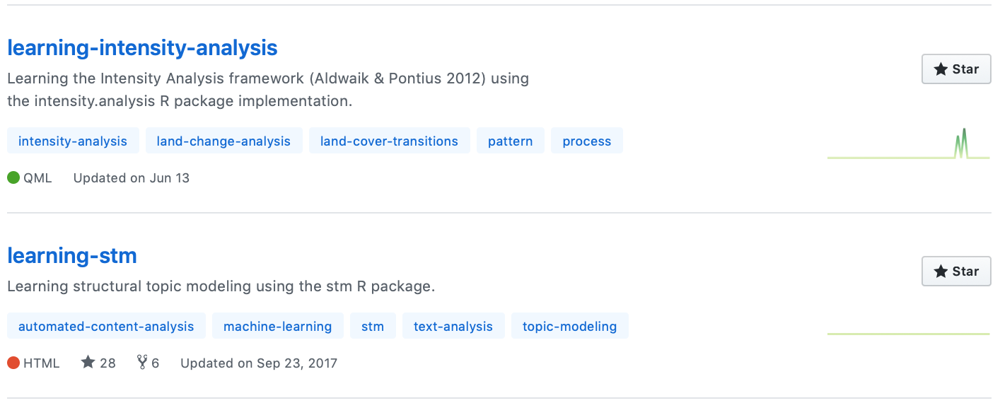

---
authors:
- admin
categories:
- Research
- Resources
date: "2019-08-11T20:12:00Z"
draft: false
featured: false
image:
  caption: ""
  focal_point: ""
  placement: ""
  preview_only: false
lastmod: "2019-08-11T20:12:00Z"
projects: []
subtitle:
summary:
tags:
- GitHub
- Google Earth Engine
- MaxEnt
- R
- reproducibility
- RStudio
title: 'Repos on GitHub.'
---

I have been sharing the coding materials and resources related to my research on my [GitHub page](https://github.com/dondealban) but I have not had the chance to blog about these here at all, even briefly. And so, let me make this short introduction on my activities on GitHub, which does seem to show (and share) more of my research activity than in this blog. It's just been about time too that I updated the 'mugshot' on my GitHub page, which used to show an old (younger) photo of me, and now, more appropriately, shows a recent photo of me taken during the wedding of a dear colleague. Anyway...

First, the repositories that accompany some of my published papers, either those I have led or had the great opportunity to co-author. I put together these materials to supplement the published papers, thereby creating a backup of the materials used and developed through the study such as data, results, scripts, and figures. By doing this, I was aiming to encourage not just other scientists and researchers but also my future self to do better science by fostering research reproducibility and transparency. It also improves the overall impact of my own research. Some of these repositories include materials for my [2018 Remote Sensing](https://github.com/dondealban/ms-remote-sens-2018) and [2019 Sustainability](https://github.com/dondealban/ms-sustainability-2019) papers, as well as a [2017 Conservation Biology](https://github.com/dondealban/ms-conserv-biol-2017) paper, all of which were done together with my lab members and principal investigator.

Second, I've created some repositories over the last couple of years for a lecture I gave at the ISPRS Student Consortium Summer School and Hackathon in 2018 where I shared about my land change research and ran a [crash course on Google Earth Engine](https://github.com/dondealban/isprs-sc-summer-school), and a short [tutorial on species distribution modeling using MaxEnt and R](https://github.com/dondealban/tutorial-qgis-maxent) that I did for my labmates during a lab retreat in 2017.

Finally, I've also developed a couple of long how-to guides or tutorials while I was starting to learn some R packages in pursuit of my research ideas. There was one on the [stm package](https://github.com/dondealban/learning-stm) on structural topic modeling for text data mining and automated content analysis; and the other on the [intensity analysis package]((https://github.com/dondealban/learning-intensity-analysis)), which has been a key component of my research on land use/cover change analysis.

Quite frankly, I am stoked to see that users on GitHub have found these repositories (and some others I have not mentioned) useful as indicated by the number of stars or forks (take the [learning-stm](https://github.com/dondealban/learning-stm) repo, for example).

Please do watch my GitHub space for more updates on my research activities. If you find the materials and resources in any way helfpful, please 'star' the repository page on GitHub, or cite the papers or accompanying repositories if you used them for your research. In case you want to contribute to the content in any of the repositories, please feel free to fork the repo and submit your pull request.

