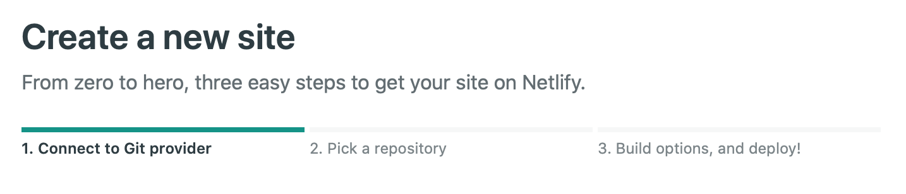

---
authors:
- admin
categories:
- Resources
date: "2020-02-02T15:00:00Z"
draft: false
featured: false
image:
  caption: ""
  focal_point: ""
  placement: ""
  preview_only: false
lastmod: "2020-02-02T15:00:00Z"
projects: []
subtitle:
summary:
tags:
- GitHub
- Hugo
- Netlify
- R
- RStudio
- static site generation
title: 'Rebuilding my website with GitHub, Hugo, R blogdown, and Netlify.'
---

I rebuilt my personal website from scratch using a static site generator, first, because I wanted a cleaner and streamlined site with an easy upkeep, plus I was motivated to learn the new tools, and more importantly, to move away from hosting on Wordpress due to the really annoying ads. The process was on and off during the past months, and although I found tips online that you can indeed complete it in a day or less, I only found time to on it very intermittently, mostly while in transit at airport terminals and during flights and over weekends, which was why it took about three months to finally deploy the sitein early February finally! My website is still incomplete and still under reconstruction, with most of my old blog posts and pages from my old 14n121e website to be slowly incorporated in my new website slowly. So please continue to watch this space!

Below, I have put together some guidance on how I rebuilt my new website with these new tools, specifically the ensemble of Hugo, R blogdown, GitHub, and Netlify, which you may find helpful in case you were wondering how you could go about building one for yourself too. I tried to put together the major steps with as much detail as I can recall, albeit I may have missed minor ones.

**Prerequisites.**
After some prior searching online, I settled on using Hugo, R blogdown, GitHub, and Netlify as the combination of tools/resources I would employ for rebuilding my website. Note that I did not mind reconstructing the site manually (e.g., migrating contents such as blog post one by one) because it was not alot and also because I wanted understand the inner workings, hence I did not pursue (semi-)automated ways that existed for migrating content from Wordpress to the new site. To get started, I ensured the following online accounts were set up and the software tools were installed in my Mac OSX machine:

- [Git](https://git-scm.com) and a [GitHub](https://github.com) account as the version control system for tracking the changes in a dedicated repository containing the website contents; 
- [R](https://cran.r-project.org) and [RStudio](https://rstudio.com), the premier IDE for R, plus the [blogdown](https://bookdown.org/yihui/blogdown/) R package developed by [Yihue Xie](https://yihui.org/en/);
- Then, [Hugo](https://gohugo.io), an open-source static site generator for building websites, plus the [Academic](https://themes.gohugo.io/academic/) Hugo theme by [George Cushen](https://georgecushen.com), of which was my personal choice for the theme given its simple and customisable functions using the [Markdown](https://daringfireball.net/projects/markdown/) markup language (and it is apt for academics/scientists/researchers); 
- In addition, I used some advanced features including [Disqus](https://disqus.com) to enable comments and discussions, and [Google Analytics](https://marketingplatform.google.com/about/analytics/) to understand my website traffic; and
- Finally, a [Netlify](https://www.netlify.com) account to enable a fast and continuous deployment of the website, once the GitHub repository was connected and the build settings were added.

Note that for most of the above, I already had prexisting registered accounts and had installed the tools, except for Netlify (so I had to sign up for a new account) and R blogdown and Hugo (both of which I had to newly install). So now let's get started:

***1. Setting up Git and GitHub, and creating a repository on Github.***
Follow these instructions to help you [install Git](https://git-scm.com/book/en/v2/Getting-Started-Installing-Git) on your machine and [setup GitHub](https://help.github.com/en/github/getting-started-with-github/signing-up-for-a-new-github-account), and once you have them both, [create a repository](https://help.github.com/en/enterprise/2.13/user/articles/creating-a-new-repository) that is located remotely on GitHub and [cloned locally](https://help.github.com/en/github/creating-cloning-and-archiving-repositories/cloning-a-repository) on your machine, which will be linked to Netlify later on so that any new content you generate in your repository gets dynamically updated on your website via Netlify. 

***2. Installing blogdown, Hugo, and the Academic theme.***
First install [R](https://www.r-project.org) and [RStudio](https://rstudio.com/products/rstudio/download/), in case you do not have these locally on your machine yet. Once you have completed that step, you can install the blogdown R package and Hugo in RStudio using the following commands:
```R
install.packages("blogdown")
blogdown::install_hugo(version = "0.63.1", force = TRUE)
```
Using the Terminal, you can find out the installed version of Hugo on your machine via:
```bash
hugo version
```
Also, check if your `config.toml` is found in the root of your project repository. Finally, you are ready to create a new site and serve it locally on your browser by using the following commands in RStudio:
```R
blogdown::new_site(theme="gcushen/hugo-academic")
blogdown:::serve_site()
```
Tada! You now have a new site and you're ready to move on to personalising your website. More information on installing blogdown, Hugo, and the Academic theme can be found [here](https://sourcethemes.com/academic/docs/install/) with specific instructions for installing via RStudio [here](https://sourcethemes.com/academic/docs/install/#install-with-rstudio).

***3. Customising your website.***
You'll find more guidance about personalising your website, especially with the way you want it by following these [Getting Started](https://sourcethemes.com/academic/docs/get-started/) instructions. As a start, the first main items you need to modify are the following:

- `/config.toml`, where you can change your site name, base URL (say with your own domain, or with a free one from Netlify), copyright display, and other advanced options;
- `/config/_default/menus.toml`, where you can change the names and the sequence of the menu links displayed on the navigation bar at the top of your homepage;
- `/config/_default/params.toml`, where you can customise your theme, modify your basic info (such as your website type, displaying a bespoke logo on your navigation bar), site details, contact details, social networks for sharing, and other regional and advanced options. You can configure your comments (e.g., Disqus), search, maps, and marketing (i.e., Google Analytics) via the `params.toml`;
- `/config/_default/languages.toml`, where you can configure another language to provide language options for your visitors/readers; and finally,
- `/content/authors/admin/_index.md`, where you can modify your biographical sketch and tell people who you are. In the same folder place a photo of yourself (called `avatar.jpg`) to display your profile photo or avatar.

You can implement so many other neat [customisations](https://sourcethemes.com/academic/docs/customization/), including customising your theme colours and fonts; choosing your website icon (or favicon); enabling Google Analytics to understand your website traffic; enabling comments or discussions for your content such as by using Disqus; selecting your social networks (e.g., Twitter) for page sharing, and many more.

One of the main customisations that I wanted to do was displaying [Altmetric](https://www.altmetric.com) badges for each of my publication pages. Following available [instructions](https://sourcethemes.com/academic/docs/customization/#add-scripts-js), I created a file called `custom_js.html` in the following folder `/layouts/partials/` under the root directory of your repository, which had the following contents:
```html
<html>
  <body>
    <script type='text/javascript' src='https://d1bxh8uas1mnw7.cloudfront.net/assets/embed.js'></script>
  </body>
</html>
```
The above script was copied from Altmetric's guidance for [embedding their badges](https://api.altmetric.com/embeds.html). And then, include the following code at the end of the body of your publication post. I did this for each of my publications that had an Altmetric page and modified the DOI accordingly.
```javascript
<div data-badge-details="right" data-badge-type="medium-donut" data-doi="10.1088/1748-9326/ab666d" data-hide-no-mentions="true" class="altmetric-embed"></div>
```
Once you have set this up, you'll see the Altmetric badge with its details similar to the one below. Customising the Altmetric badge to your linking is easy and you can follow these [instructions](https://api.altmetric.com/embeds.html).

<div data-badge-details="right" data-badge-type="medium-donut" data-doi="10.1088/1748-9326/ab666d" data-hide-no-mentions="true" class="altmetric-embed"></div>

***4. Deploying your website using Netlify.***
Finally, it is time to deploy your website for free on Netlify. To create your new website, first, you need to choose and connect to your Git provider (in this case GitHub) where your site's source code is hosted for continuous deployment. That means when you push to Git, Netlify runs your build tool of choice on their servers and deploys the result. Then, pick the repository where your site's source code is located. Finally, build and deploy! Although I only used a free Netlify account, you can [add a custom domain](https://app.netlify.com/sites/dondealban/settings/domain/setup) for your site if you prefer. 


**Concluding Remarks.**
You will definitely spend a good amount of time customising your site, particularly during the initialisation stage. But once you have most of your site elements and pages completed, updating becomes much easier. For example, I create new content exclusively in RStudio, such as a new blog post, a recent publication, or news item. This means that when I save the files and once I am ready to deploy the new content to my wesbite, I instantiate a commit of the recent changes and push the changes to the [public repository](https://github.com/dondealban/dondealban) of my website. And since this repository is dynamically linked to Netlify, new content or any changes get deployed automatically on my website via Netlify.  

As a final note, I have to say that the initial setup required some effort and time to learn a few new tools—and troubleshoot as required—but in the end, I was satisfied with the process and the outcome, and also from knowing that from here on the upkeep required to maintain my online presence would be minimal.

**Acknowledgements.**
I used several resources online including instructions of how to use Hugo, blogdown, and Netlify, which of note were the helpful and easy-to-follow instructions from [Yihue Xie](https://resources.rstudio.com/authors/yihui-xie) for [blogdown](https://resources.rstudio.com/webinars/introducing-blogdown) and [George Cushen](https://georgecushen.com) for the [Academic theme](https://sourcethemes.com/academic/) for Hugo. I've benefitted alot from reading blog posts, especially [getting up and running with blogdown](https://alison.rbind.io/project/up-running-blogdown/) and a [week of blogdown](https://summer-of-blogdown.netlify.com/people/) by Alison Hill; [building my website with blogdown](http://www.katherinescranton.com/post/building-my-website-with-blogdown/) by Katie Scranton; [how to make your own website for free for under and hour](https://www.dsquintana.blog/free-website-in-r-easy/) by Dan Quintana; [creating a website with the Academic theme in blogdown](https://www.kevinzolea.com/post/blogdown/creating-a-website-with-the-academic-theme-in-blogdown/) by Kevin Zolea; and [tips for using the Academic theme](https://lmyint.github.io/post/hugo-academic-tips/) by Leslie Myint. I also found bits of inspiration about the content possibilities of using the Hugo Academic theme from the bespoke designs of the websites of [Erika Fille Legara](https://erikalegara.site), [Zhi Yang](https://zhiyang.netlify.com), [Daniel Quintana](https://www.dsquintana.com), [Alison Hill](https://alison.rbind.io/), and [Leslie Myint](https://lmyint.github.io), which were all super helpful. 

Special thanks to Lloyd Zapanta for developing a true type font for the [Baybayin](https://en.wikipedia.org/wiki/Baybayin) script, which is the indigenous alphabet writing script of pre-colonial Philippines. He designed several true type fonts of the Baybayin script, of which I particularly used [Baybayin Sisil](https://www.behance.net/gallery/67528161/FREE-FONT-Baybayin-SISIL-Brush-Style-Font) rendition for creating my website logo, which is essentially my written name in Baybayin to express my ethnic roots.